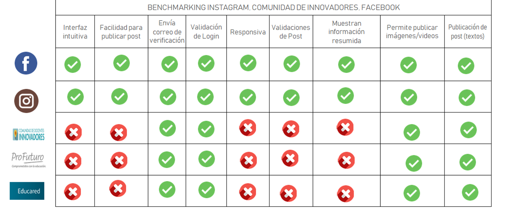

# RED SOCIAL EDUTECH ("Compartiendo nuestras mejores experiencias en Tecnología y Educación ")
## Preámbulo
Las tecnologías de la Información y Comunicaciones TICS son las nuevas innovaciones tecnológicas. En la actualidad son de gran importancia en la educación ya que a través de ellas se han desarrollado nuevas estrategias del aprendizaje dentro de los diversos Entornos Virtuales, asi mismo las TIC son usadas a diario por los inmigrantes digitales(personas que adquirieron familiaridad con los sistemas digitales ya siendo adultos) ,convirtiendo a las TICS en  herramientas indispensables para el desarrollo de sus actividades conditianas, sin embargo se puede notar que el 60 % de los docentes  no incluyen estas TICS en la planificación y desarrollo de sus sesiones de aprendizaje ,privandose  de los beneficios que se obtiene del uso adecuado de las mismas, para el desarrollo de las inteligencias múltiples de sus estudiantes, por el cual, la razón principal de esta Red Social Edutech es asociar las buenas experiencias que han ido obteniendo los inmigrantes digitales con las estrategias o métodos eficacez  que  a diario ejercen los docentes para transmitir sus ideas,pues según la encuesta y entrevistas realizadas , inmigrantes digitales consideran que es muy importante para ellos aprender nuevas formas de transmitir sus ideas de manera efectiva y consideran que sería interesante obtener estos tips de personas especialistas en estas facetas de educación.Logrando asi con EDUTECH  disminuir la notable brecha que existente entre los docentes y las TICS y al mismo tiempo beneficiar a los usuarios de tics para una mejor o efectiva comunicación con personas de su entorno.

## Introducción

EDUTECH es una comunidad de Inmigrantes Digitales y Educadores, donde ambos lados se benefician compartiendo sus buenas experiencias respecto al uso de las  TICS como tambien aprendiendo nuevas estrategías o técnicas de enseñanza para transmitir sus ideas  de forma eficaz.Beneficiando así a ambas partes.

## Objetivos

## Definición del producto:
  ¿ Cuáles son los elementos básicos que tiene una red social?
  
  * [ ] Quiénes son los principales usuarios de producto.
  * [ ] Cómo descubriste las necesidades de los usuarios.
    
    

  * [ ] Qué problema resuelve el producto para estos usuarios.
  * [ ] Cuáles son los objetivos de estos usuarios en relación con el producto.
  * [ ] Cuáles son las principales funcionalidades del producto y cuál es su prioridad.
  * [ ] Cómo verificaste que el producto les está resolviendo sus problemas.
  * [ ] Cómo te asegurarás que estos usuarios usen este producto.
* [ ] Benchmark de las principales redes sociales.
* [ ] Resumen de entrevistas con usuarios.
* [ ] Link/screenshots del prototipo de alta fidelidad.
* [ ] Conclusiones de testing con el prototipo de alta fidelidad con usuarios.
* [ ] Conclusiones de testing con el producto en HTML.
### UX

Desde el punto de vista de UX, deberás:  

* Hacer un _benchmark_ de las principales redes sociales.
  

* Hacer al menos 2 o 3 entrevistas con usuarios.
* Hacer un prototipo de alta fidelidad.
* Testear el prototipo con usuarios.
* Asegurarte de que la implementación en código siga los lineamientos del
  diseño.
* Hacer sesiones de testing con el producto en HTML.

#### 1) Definición del producto

En el `README.md` debes colocar cómo conociste el mercado de las redes sociales, cómo descubriste las necesidades de los usuarios, y cómo llegaste a la definición final de tu producto. Si tienes fotos de entrevistas, cuestionarios y/o sketches
(bocetos) compártelos. Es importante que detalles:

* Cuáles son los elementos básicos que tiene una red social.
* Quiénes son los principales usuarios de producto.
* Cómo descubriste las necesidades de los usuarios.
* Qué problema resuelve el producto para estos usuarios.
* Cuáles son los objetivos de estos usuarios en relación con el producto.
* Cuáles son las principales funcionalidades del producto y cuál es su prioridad.
* Cómo verificaste que el producto les está resolviendo sus problemas.
* Cómo te asegurarás que estos usuarios usen este producto.

Para poder llegar a estas definiciones te recomendamos revisar: benchmarks, entrevistas con usuarios y tests de usabilidad.
